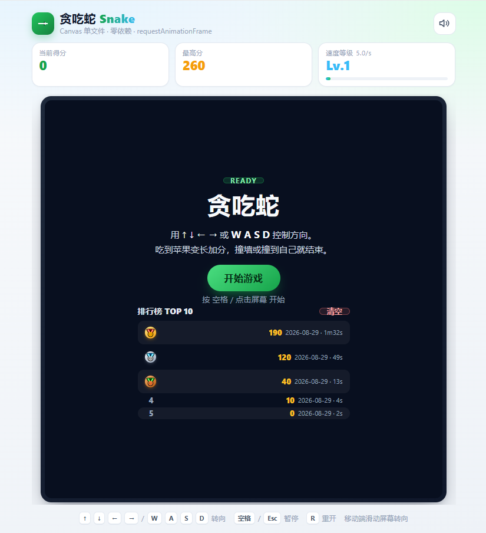
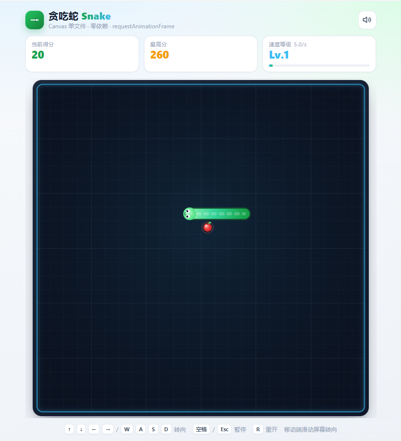

# 贪吃蛇 Snake Game

一个**零依赖、单文件**的 Canvas 贪吃蛇。双击 `index.html` 即可在浏览器里玩，不需要 npm、不需要构建、不需要本地服务器。

## 运行方式

```
双击 index.html
```

或者把整个 `snake-game` 目录扔进任意静态服务器（可选）。推荐 Chrome / Edge / Firefox 最新版。

> 直接以 `file://` 方式打开时，部分浏览器的隐私设置会禁用 `localStorage`，此时最高分只在当前页面有效、刷新即清零。游戏本身不受影响（已做 try-catch 兜底，不会报错）。想持久化最高分就用 `npx serve` 之类的静态服务器打开。

## 预览






## 操作方式

| 操作                | 按键                                |
| ----------------- | --------------------------------- |
| 转向                | `↑` `↓` `←` `→` 或 `W` `A` `S` `D` |
| 开始 / 暂停 / 继续 / 重开 | `空格`                              |
| 暂停 / 继续           | `Esc`                             |
| 重新开始              | `R`（任意状态下）                        |
| 开始游戏              | 开始界面按**任意键**或点击屏幕                 |
| 音效开关              | 右上角喇叭图标（状态会持久化）                   |
| 手机端               | 在画布上**滑动**转向；游戏中**轻点屏幕**暂停，再轻点继续；准备/结束屏轻点开始/重开 |
| 升级卡选择            | `1` `2` `3` 或直接点击卡片（过关时弹出）            |
| 主题切换              | 右上角月亮/太阳图标，在**浅色 / 深色（夜间）**间切换（持久化） |

## 功能清单

- 网格化贪吃蛇核心玩法：吃食物加分（蛇身**不变长**，变长改由过关触发），食物在空白处随机重生
- 失败判定：撞墙、撞到自己的身体（能区分死因，结束界面给出对应提示）
- 方向缓冲队列，彻底防住 180° 反向自杀和「一帧内连按两次穿身」
- 速度随**过关**递增，带上限（4 → 13 格/秒，`tps = min(4 + 0.9×level, 13)`，level 由过关驱动）
- 当前得分 / 最高分（`localStorage` 持久化）/ 速度等级 + 速度进度条
- **排行榜**（`localStorage` 持久化，最多 10 条）：点开始屏「🏆 排行榜」按钮进入**独立面板**展示 Top 10，前三名金银铜奖牌 + 当前玩家行高亮；结束屏显示「第 N / M 名」名次徽章（前三名金银铜配色 + 脉动新纪录）并可改名（默认名 `Ply`，≤3 字符），清榜带 5 秒二次确认倒计时，隐私模式下静默降级
- 四态状态机：ready / playing / paused / gameover
- 页面切到后台或窗口失焦 → 自动暂停
- 窗口尺寸变化 → 画布自适应重绘（按 devicePixelRatio 渲染，高分屏不糊）
- 响应式布局，桌面 / 手机都能满屏玩
- Web Audio 代码合成音效：吃食物、撞毁、破纪录、开始、暂停（无外部音频文件）
- 视觉：苹果带果梗叶片 + 呼吸光环、蛇身圆头折线 + 鳞片虚线 + 蛇头眼睛嘴巴、吃食粒子爆开、`+10` 飘字、撞击震屏
- 棋盘被填满时判定为通关（理论存在，正确兜底）
- **性能优化**：背景 / 网格 / 墙烘焙到离屏 canvas（只在 resize 时重画），每帧只 `drawImage` 复用，省掉每帧 `createRadialGradient` + 48 条网格线 `stroke` 的开销；非 PLAYING 态且无任何动画时降频到 30fps（体感仍丝滑）
- **移动端体验闭环（B 轮）**：
  - **轻点暂停**：游戏中轻点屏幕即暂停，再轻点（或点遮罩「继续游戏」）继续；准备/结束屏轻点沿用开始/重开
  - **暂停特效冻结**：暂停时 `Fx.update` 不推进，`Fx.time` 不累加、粒子/飘字/震屏/食物呼吸全部定格，画面完全静止
  - **浅/深主题切换**：右上角图标一键切换浅色（浅卡片 + 深画布）与深色（深卡片 + 浅字）主题，`localStorage` 持久化，刷新后保留
- **特殊食物（C 轮 · P1 体验增强）**：游戏过程中棋盘上会随机刷新特殊食物（同一时刻最多一颗，约每 9 秒一次），吃到触发限时效果、不增长蛇身：
  - **🍊 金蛇果（加速）**：临时 +4 格/秒，持续 5 秒
  - **❄️ 冰冻果（减速）**：临时 −3 格/秒（不低于 3 格/秒下限），持续 4 秒
  - **💎 限时奖励**：立即 +25 分（速度等级由过关驱动，不随分数变化），不吃则 6 秒后消失
  - 三种食物外观各异（金/冰为圆身带果梗叶片、奖励为旋转菱形），均带「限时环」随剩余时间收缩提示抓紧；吃到时对应粒子爆开 + 飘字（`⚡加速` / `❄减速` / `+25`）＋ 专属音效
  - 吃到加速/减速期间，画布顶部中央显示 **加速/减速状态条**（图标 + 倒计时），暂停时与画面一同冻结；状态条 `pointer-events:none` 不抢操作

- **关卡 / 障碍 / Boss 蛇（D 轮 · P1 体验增强）**：闯关模式——吃满目标食物即进入下一关，难度递进；**每过一关升一级**：速度随之变快、蛇身增长 `GROW_PER_STAGE` 节（吃普通食物本身不变长，变长改由过关触发）：
  - **障碍物**：第 2 关起每升一关在棋盘随机新增石板障碍（避开蛇/食物/特殊食物），撞到扣 1 点生命
  - **Boss 蛇**：第 3 / 6 关（共 6 关）迎战 Boss（F 轮已进化为可击破的多形态 Boss，见下），撞上玩家扣 1 点生命；清空第 6 关即**通关**
  - 进关瞬间画布中央淡入淡出显示 **「第 N 关」** 横幅；画布顶部居中悬浮一颗紧凑的 **关卡芯片**显示「关卡 · 第 N 关 · 食物 X/Y」，不占 flex 高度，给画布让出更多垂直空间；障碍 / Boss 均绘制在画布上，暂停时与画面一同冻结
- **生命值 / Combo 连击 / 过关三选一（E 轮 · 玩法深度升级）**：把「一撞就结束」改成「有代价的失误」，并给每局加上成长曲线：
  - **生命值 3 点**：撞墙 / 撞障碍 / 咬到自己 / 撞 Boss 都只扣 **1 点**，并进入 **1.2 秒免伤**（蛇身青色闪烁 + 自动收缩 2 节喘口气），**扣光才结束**。免伤期间撞任何东西都停在原地，绝不重复扣血
  - **Combo 连击**：8 秒内连续进食累积层数，每层 **+10%** 得分（第 N 连 = `1 + (N-1)×0.1`，封顶 **×3**）；画布顶部悬浮 **连击条**（倍率 + 层数 + 倒计时），超时或受击清零，结算屏展示「最高连击」
  - **过关三选一**：每过一关从 6 张升级卡里抽 3 张，**选一张才继续**（键盘 `1`/`2`/`3` 或点击卡片；选卡时逻辑暂停、画面继续渲染）：

    | 卡        | 效果                          | 叠加上限 |
    | -------- | --------------------------- | ---- |
    | ♥ 强心     | 生命上限 +1，并立即回复 1 点        | 3    |
    | ⚡ 连击大师   | 连击窗口 +2 秒                  | 3    |
    | ★ 贪婪     | 所有得分 +15%                  | 3    |
    | ◈ 护盾果    | 特殊食物池加入护盾果，吃到获 6 秒免伤     | 2    |
    | ❄ 稳如老狗   | 基础速度 −0.8 格/秒              | 3    |
    | ✚ 急救包    | 立即回复 1 点生命（满血时不出现在候选）   | —    |

  - **◈ 护盾果**：青绿盾牌造型的特殊食物，吃到即获得 6 秒免伤，期间 Boss 撞上来也不掉血
- **Boss 进化（F 轮 · 把「躲着走的蛇」变成真对手）**：Boss 从「不可交互的威胁」变成「可以打的目标」：
  - **弱点在尾**：撞中 Boss 的**尾节**扣它 1 点血（尾节有脉动虚线圆环标记），**撞身体才轮到玩家扣血**。击破一条 Boss **+60 分**（吃贪婪倍率）
  - **Boss 血条**：画布顶部显示「形态名 + 剩余血量」，多条 Boss 时显示合计血量与条数；Boss 被打中时整条闪白
  - **三种形态**：

    | 形态           | 出场    | 体型 / 血量   | 行为                                       |
    | ------------ | ----- | -------- | ---------------------------------------- |
    | 追猎者（暗红）      | 第 3 关 | 7 节 / 3 血 | 一路追食物，D 轮原行为                              |
    | 分裂者（紫红）      | 第 6 关 | 8 节 / 4 血 | 被击破后炸成 **2 条游猎者**，全灭才算打完                   |
    | 游猎者（橙红）      | 分裂产物  | 4 节 / 1 血 | 每 3.2 秒朝玩家**直线冲刺**一次，冲刺前 0.45 秒有闪烁箭头预警    |

  - **毒区地形**：Boss 关随机生成 **3 片 2×2 紫色毒区**，每 5 秒漂移一格；蛇头踩进去扣 1 点生命。毒区漂移**永远不会主动压到玩家蛇身与食物**，食物也不会刷在毒区里 —— 它是压缩走位的地形，不是必死陷阱

- **模式与长线（G 轮 · 把「一局结束」变成「长期旅程」）**：在原来「闯关」的基础上，开始屏新增模式选择与皮肤切换，并补齐成就系统与跨局统计，让每局都有目标与累积意义：
  - **三种模式**（开始屏点选，持久化）：
    - **闯关**（原有）：6 关递进、过关三选一、Boss 与毒区，清空第 6 关即通关
    - **无尽**：吃到食物就变长（`GROW_EVERY` 颗一节），速度随分数稳步上涨，撞光生命为止；每升 `UPGRADE_EVERY_LEVEL` 级也会弹一次升级卡
    - **限时**：`TIME_ATTACK_SEC`（60 秒）内冲刺拿分，时间到即结算（算「完成」不算「死亡」），结束文案显示本局得分
  - **成就系统（12 项）**：初出茅庐 / 百分达人 / 五百俱乐部 / 千分传说 / 连击新手 / 连击大师 / 屠龙者 / 弑君者 / 通关 / 幸运儿 / 风驰电掣 / 长寿蛇。达成瞬间画布内滑入提示卡 + 专属上行音效（`Sfx.achievement`），`localStorage` 持久化，重开不丢
  - **皮肤解锁（5 款）**：青竹（默认）/ 鎏金（单局 500 分）/ 虚空（击破首条 Boss）/ 霜蓝（15 连击）/ 赤焰（通关）。皮肤配色接入蛇身与蛇头渲染，开始屏点选切换；未解锁的皮肤带锁标记，点了也不生效
  - **数据统计**：跨局累计总局数 / 通关数 / 总得分 / 总食物 / 总时长 / 最高连击 / 击破 Boss 数，存 `localStorage`，开始屏档案区展示；脏数据 `try-catch` 兜底

## 实现要点

### 游戏循环

`requestAnimationFrame` + **时间累加器**做固定步长：逻辑按 tick 推进，渲染每帧进行。

```js
dt = Math.min(dt, 0.25);                       // clamp，切后台回来不补算
accumulator += dt * 1000;
while (accumulator >= interval && steps < MAX_STEPS_PER_FRAME) {
  accumulator -= interval;
  Game.tick();
}
// 关键：累加器封顶，丢弃本帧消化不掉的时间欠账
accumulator = Math.min(accumulator, MAX_STEPS_PER_FRAME * interval);
alpha = accumulator / interval;                // 用于渲染插值
```

- `dt` 上限 0.25s，切后台回来不会一次性补算几十步
- 单帧最多补 `MAX_STEPS_PER_FRAME`（4）个 tick，卡顿后不会瞬移
- **累加器封顶**：持续低帧率（<4fps）叠加高等级时，单帧 4 步消耗不完 clamp 后的 250ms，剩余时间若不丢弃会无限累积，帧率恢复后会以 4 步/帧长时间「快进补账」而不是与真实时间重新同步。封顶后最多只欠一帧的量，代价是低帧率下游戏略慢 —— 这是正确的优雅降级
- 暂停恢复时清空累加器，避免「恢复瞬间连跳」
- 空格在 playing 态走 pause 分支（遮罩此时是 hidden，点击路径不会误触）

### 渲染插值

每 tick 保存一份 `prevSnake`，渲染时对每节身体做 `prev → cur` 的线性插值，所以蛇是**连续滑动**的，而不是一格一格地蹦。

蛇身用**圆头折线一次描边**（`lineJoin = 'round'`、`lineCap = 'round'`）画出来，转弯处天然平滑无裂缝；再叠一层虚线做出鳞片分节的质感。比逐格画圆角矩形更干净，也省掉了拼接缝隙的处理。

### 防反向

方向输入进缓冲队列（上限 3 个），入队时与**队列最后一个方向**（队列空时与当前方向）比对：

- 同向 → 忽略
- 反向 → 忽略
- 否则 → 入队

逐级校验保证了出队执行时绝不可能出现 180° 掉头，也就根除了「同一帧内快速按 上→下 导致反向穿身」这类经典 bug。

### 碰撞检测

```js
const willGrow = (food.x === nx && food.y === ny);
const limit = snake.length - 1;  // 移动是等长的，尾巴会让出当前格，故最后一节不计入碰撞
```

移动是等长移动（吃食物不再变长），蛇尾本 tick 会让出当前格，所以最后一节不计入碰撞 —— 紧贴着尾巴走是合法的。

死亡时**不修改蛇身**，蛇停在撞墙前的位置，不会出现「半个身子插进墙里」。

### 食物生成

用 `Uint8Array` 标记蛇身占据的格子，统计空格数后按序号随机取一格，O(n) 一次遍历。棋盘填满时返回 `false` → 判定通关。

### 代码结构

单文件内按职责划分模块，逻辑与渲染完全分离：

```
Config    配置常量
Storage   localStorage 读写（try-catch 兜底隐私模式）
Leaderboard  排行榜存储 / 排序 / 去重 / 改名 / 清榜（同 Storage 兜底）
Sfx       Web Audio 音效合成
Game      纯游戏逻辑（不触碰 DOM）
Fx        粒子 / 飘字 / 震屏（只影响表现层）
Renderer  纯渲染（不修改游戏状态）
UI        HUD + 遮罩面板 + 排行榜渲染
Input     键盘 + 触摸滑动
App       状态切换 + 主循环
```

### 遮罩层（三屏）布局

开始 / 暂停 / 结束三套 overlay 模板全部走**正常文档流**（`flex` 纵向列 + `gap`），不使用绝对定位叠字，彻底消除「游戏结束」大字与副标题 / 分数上下重叠的问题。字号 / 间距统一使用 `clamp(min, cqw, max)`（容器查询宽度单位，随画布宽度缩放）或 `em`，**不硬编码 px**：

- 标题 `h2`：`clamp(24px, 7cqw, 40px)`，按「容器宽度」递缩
- 说明 `.desc`：`clamp(12px, 3cqw, 15px)`
- 按钮 `.btn`：`clamp(14px, 3.5cqw, 16px)`
- 分数 `.scores .v`：`clamp(18px, 4.8cqw, 28px)`
- 各区块之间用 `gap: clamp(8px, 2.2cqw, 14px)` 隔开，窄屏不重叠、不断行错乱

开始屏点「🏆 排行榜」按钮进入独立面板展示 Top 10 列表（无数据显示「暂无记录」），结束屏显示「你的名次：#X / 共 Y 条」与改名输入框，暂停屏**不含**排行榜。

### E 轮：容错与成长

**受击而不是死亡**：`tick()` 里四类碰撞（墙 / 障碍 / 自己 / Boss）统一交给 `Game.hit(reason)`：扣 1 点生命 → 进入 1.2 秒免伤 → 蛇身收缩 2 节；只有 `lives` 归零才返回 `'dead'`。主循环收到 `'hit'` 只播受击特效（`App.onHit`：震屏 + 红粒子 + `-1 ♥` 飘字 + 闷响）后 `continue`，对局照常推进。

**免伤期间一律停在原地**（返回 `'blocked'`），既不环绕也不穿透：

- 环绕：蛇头会瞬移到对侧，与第二节相隔整张棋盘，折线渲染会画出一条贯穿全屏的断线
- 穿透身体：蛇头进入身体格，与那一节重叠，蛇身画出来会打结
- 两者都比「贴着墙停 1.2 秒」更伤，所以选了最保守的一种

**连击计分**：`gainFoodScore()` 先 `combo++` 再按 `comboMultiplier()` 结算，实际得分 = `SCORE_PER_FOOD × 连击倍率 × scoreMul`（贪婪）。`comboTimer` 只由主循环的 `updateTimers(dt)` 递减，暂停时随画面一起冻结；受击立即清零。

**升级卡**：卡池 `UPGRADES` 是独立常量（`id` / 图标 / 描述 / 叠加上限 / `apply(game)`），`rollUpgrades()` 洗牌后取三张，并排除已满级以及 `available()` 不满足的卡（满血时不给急救包）。过关时 `advanceStage()` 顺手抽好卡，主循环在 `'stageclear'` 分支调 `openUpgrade()` 把 `Game.awaitingUpgrade` 置真 —— **这个标志会让 tick 循环停止推进**，但渲染照常，所以选卡时画面不会僵死。选完 `applyUpgrade()` 生效、清标志、继续下一关。

### F 轮：Boss 进化

**数据结构**：`Game.boss` 单体改成了 `Game.bosses` **数组**，因为分裂体会与本尊共存。每条 Boss 自带 `hp / maxHp / kind / dashTimer / dashWarn / dashTime / dashDir / hitFlash`，各自有独立的移动累加器。

**弱点与伤害**：`bossAt(x, y)` 返回 `{boss, idx, isTail}`，`tick()` 里据此分流——`isTail` 走 `damageBoss()`（Boss 扣血、玩家安全通过），否则走 `hit('boss')`（玩家扣命）。击破时**先 `removeBoss()` 再 `splitBoss()`**：顺序反了会失败，因为 `spawnBossAt` 会把本体尚未释放的身体当成障碍物，导致分裂体一处都放不下。

**冲刺状态机**（游猎者）：`待机 → 预警(0.45s，锁定方向 + 闪烁箭头) → 冲刺(0.85s，速度 ×2.4) → 待机`。预警的意义是给玩家反应窗口，没有它冲刺就是不讲理的瞬移。撞墙或撞身体会提前结束冲刺并转回追击。

**踩过的坑**：`spawnBossAt` 必须从**远端往回铺**（`for (let i = len - 1; i >= 0; i--)`），让 `snake[0]`（头）落在身体前方。早先的写法把头铺在了身体后方，头一迈步就撞上自己的第二节——对追击型只是浪费一步，对冲刺型则是致命的：冲刺永远起不了步。

**毒区的安全约束**：毒区是「压缩走位」的地形，不是必死陷阱，所以三条硬约束写死在代码里——生成时不与蛇 / Boss / 食物 / 障碍重叠；漂移时若新位置会压到玩家蛇身或食物则原地不动；`placeFood()` 与 `randomEmptyCell()` 都把毒区算作占用，食物永远不会刷在毒区里。

### G 轮：模式 / 成就 / 皮肤 / 统计

**模式切换**：`Game.mode` 由 `setMode(id)` 设定，非法 id 兜底回 `stage`。`shouldGrow()` 只在非闯关模式按 `foodEaten % GROW_EVERY` 变长——闯关模式仍由过关触发增长（与历史约定一致，避免直接 `reset()` 误判）。限时模式用 `timeLeft` 倒计时，归零走与死亡不同的「时间到」结算分支（记 `win=false` 但算完成，结束文案显示本局得分）。

**成就判定两阶段**：`checkAchievements()` 把全部 12 项判定集中在一处；但「初出茅庐（完成第一局）」依赖累计的 `Stats.data.games`，所以 `gameOver()` 里**先按本局数据结算一次成就 → `Stats.merge()` 合入本局 → 再结算一次**，第二次才能解锁「完成第一局」。新解锁成就通过 `showAchievement()` 滑入提示卡并播 `Sfx.achievement()`。

**皮肤与配色**：`SNAKE_SKINS` 是独立常量（id / 名称 / 解锁成就 / 5 个配色字段），`Skins.currentSkin()` 返回当前可用皮肤（未解锁自动兜底 `classic`）。`Renderer.drawSnake` / `drawHead` 的配色全部取自这里，换肤即换色不换形状。

**统计兜底**：`Stats` / `Achievements` / `Skins` 的 `load` 都做脏数据 `try-catch`，隐私模式下 `save` 静默降级，绝不抛异常。

### 排行榜

键 `snake-leaderboard`，`JSON` 数组、最多 `LEADERBOARD_MAX`（10）条，每条：

```js
{ name: string(≤3字符), score: number, date: ISO date string, duration: number(秒) }
```

- 名次按分数降序、同分按时间倒序（新的在前）
- **同名同分视为同一条记录**：再次提交会替换旧记录并保留最新时间
- 结束一局后默认以 `Ply` 入榜，可在结束屏点击「改名」改成 ≤3 字符、回车或点「保存」确认（改名即换名，成绩与时间不变）
- **开始屏 Top 10 视觉**：前三名使用 🥇🥈🥉 奖牌 emoji（金 / 银 / 铜渐变 + 阴影），当前玩家的行高亮（绿色 + 「你」徽标），与最近一局同名的记录视觉上很容易找
- **结束屏名次徽章**：本局名次用圆形奖牌徽章展示（前三名金银铜配色），新纪录额外带脉动动画
- 开始屏「清空」按钮采用 **5 秒二次确认倒计时**：首次点击进入确认态（按钮显示「确认清空 (Ns)」倒数），5 秒内再次点击才真正清空，超时自动取消 —— 防止误点
- 读取 / 写入全部 `try-catch` 兜底，脏数据（非法 JSON / 非数组 / 字段异常）降级为空榜或忽略该条，绝不抛异常崩溃

## 调参

想改难度直接调文件顶部的 `Config`：

```js
COLS: 24,              // 棋盘列数（ROWS 保持相等，画布才是正方形）
BASE_TPS: 4,           // 初始速度：格/秒（降低难度）
MAX_TPS: 13,           // 速度上限（降低难度）
TPS_PER_LEVEL: 0.9,    // 每级加速（降低难度，升级更平缓）
SCORE_PER_FOOD: 10,    // 每颗食物得分
SCORE_PER_LEVEL: 100,  // 每多少分升一级（100 分 = 10 颗食物）

// C 轮：特殊食物
SPECIAL_GOLD_ADD: 4,     // 金蛇果加速 +4 格/秒
SPECIAL_GOLD_TIME: 5,    // 金蛇果 buff 持续 5 秒
SPECIAL_ICE_ADD: 3,      // 冰冻果减速 3 格/秒
SPECIAL_ICE_TIME: 4,     // 冰冻果 buff 持续 4 秒
SPECIAL_BONUS_SCORE: 25, // 限时奖励 +25 分
SPECIAL_MIN_TPS: 3,      // 减速下限（不低于此速度）
SPECIAL_SPAWN_INTERVAL: 9000  // 平均每 9 秒自动刷新一个特殊食物

// D 轮：关卡 / 障碍 / Boss 蛇
TOTAL_STAGES: 6,         // 通关所需关卡数（清空第 6 关 = 胜利）
STAGE_BASE_TARGET: 4,    // 第 1 关需吃到的食物数
STAGE_TARGET_STEP: 2,    // 每关递增的食物目标（第 N 关 = 4 + (N-1)*2）
OBSTACLE_STEP: 3,        // 每升一关新增的障碍物数量（第 1 关无障碍，第 2 关起出现）
BOSS_FIRST_STAGE: 3,     // Boss 蛇首次出现的关卡
BOSS_EVERY: 3,           // 之后每隔几关再来一次（3、6…）
BOSS_LEN: 7,             // Boss 蛇初始长度
BOSS_SPEED_TPS: 4,       // Boss 蛇移动速度（格/秒，独立于玩家）
GROW_PER_STAGE: 2,       // 每过一关蛇身增长的节数

// E 轮：生命值 / Combo / 升级卡
START_LIVES: 3,          // 初始生命（撞毁只扣 1 点，扣光才结束）
MAX_LIVES: 6,            // 生命上限（防止「强心」无限叠）
HIT_INVINCIBLE: 1.2,     // 受击后免伤秒数
HIT_SHRINK: 2,           // 受击后蛇身收缩节数
COMBO_WINDOW: 8,         // 连击窗口秒数
COMBO_STEP: 0.1,         // 每层连击加成
COMBO_MAX_MUL: 3,        // 连击倍率上限
SHIELD_TIME: 6,          // 护盾果提供的免伤秒数
SHIELD_TTL: 8,           // 护盾果在场上停留秒数
CALM_TPS: 0.8,           // 「稳如老狗」每层降低的基础速度（格/秒）

// F 轮：Boss 进化
BOSS_HP_BASE: 3,         // Boss 基础血量（撞中尾巴扣 1 点）
BOSS_HP_STEP: 1,         // 每往后一个 Boss 关，血量 +1
BOSS_KILL_SCORE: 60,     // 击破一条 Boss 的得分
BOSS_DASH_INTERVAL: 3.2, // 游猎者两次冲刺的间隔（秒）
BOSS_DASH_WARN: 0.45,    // 冲刺前的预警时长（锁定方向 + 箭头闪烁）
BOSS_DASH_TIME: 0.85,    // 冲刺持续时长（秒）
BOSS_DASH_MUL: 2.4,      // 冲刺期间的速度倍率
BOSS_SPLIT_COUNT: 2,     // 分裂者被击破后炸出的小蛇数
BOSS_SPLIT_LEN: 4,       // 分裂体长度（节）
BOSS_SPLIT_HP: 1,        // 分裂体血量
HAZARD_COUNT: 3,         // Boss 关的毒区数量
HAZARD_SIZE: 2,          // 毒区边长（格）
HAZARD_DRIFT: 5          // 毒区每隔几秒漂移一格

// G 轮：模式 / 成就 / 皮肤 / 统计
TIME_ATTACK_SEC: 60,     // 限时模式时长（秒）
GROW_EVERY: 1,           // 无尽 / 限时：每吃几颗变长 1 节（闯关模式固定不变长）
UPGRADE_EVERY_LEVEL: 3,  // 无尽模式：每升几级弹一次升级卡
ACH_TOAST_TIME: 3.2      // 成就提示卡停留秒数
```

速度曲线：`tps = min(4 + level × 0.9, 13)`，`level` 由过关驱动（`advanceStage` 中 `level++`），不再随分数变化。
即每吃 10 颗食物提速一档，约第 10 档（100 颗食物、1000 分）触顶 13 格/秒。
吃到金蛇果/冰冻果时 `tps` 临时叠加 `speedBuffAdd`（正加速 / 负减速），减速受 `SPECIAL_MIN_TPS` 下限保护；该 buff 仅 `PLAYING` 态随时间衰减，暂停时随画面一起冻结。

**关卡递进（D 轮）**：闯关模式下吃满本关目标食物即进入下一关（`stageclear`），目标随关卡递增；第 1 关无障碍，第 2 关起每关随机新增 `OBSTACLE_STEP` 块石板障碍（避开蛇/食物/特殊食物）；第 `BOSS_FIRST_STAGE` 及之后每隔 `BOSS_EVERY` 关生成 Boss 蛇，清空第 `TOTAL_STAGES` 关即通关。**过关即升一级**：`level++`（速度随之变快，见 `tps()`），并在尾部沿合法方向延伸 `GROW_PER_STAGE` 节（蛇身增长）；吃普通食物本身不变长，变长改由过关触发。

## 文件

```
snake-game/
├── index.html   # 完整游戏（HTML + CSS + JS 全部内联，无任何外部资源引用）
├── README.md
└── tests/       # Node 内置 test runner 测试（harness 抽离 index.html 内联脚本在 vm 沙箱实跑）
    ├── harness.js            # 测试脚手架：最小 DOM / Canvas / WebAudio / localStorage 替身
    ├── 01~12-*.test.js      # 原有玩法 / 状态机 / 存储 / 回归 / B 轮测试
    ├── 13-c-round.test.js   # C 轮特殊食物测试（18 条）
    ├── 14-d-round.test.js   # D 轮关卡/障碍/Boss 测试（14 条）
    ├── 15-e-round.test.js   # E 轮生命/连击/升级卡测试（28 条）
    ├── 16-f-round.test.js   # F 轮 Boss/毒区测试（19 条）
    ├── 17-g-round.test.js   # G 轮模式/成就/皮肤/统计测试（28 条）
    └── 18-leaderboard-ui.test.js  # 排行榜独立按钮/面板测试（5 条）
```

### 跑测试

```bash
cd tests && node --test
```
